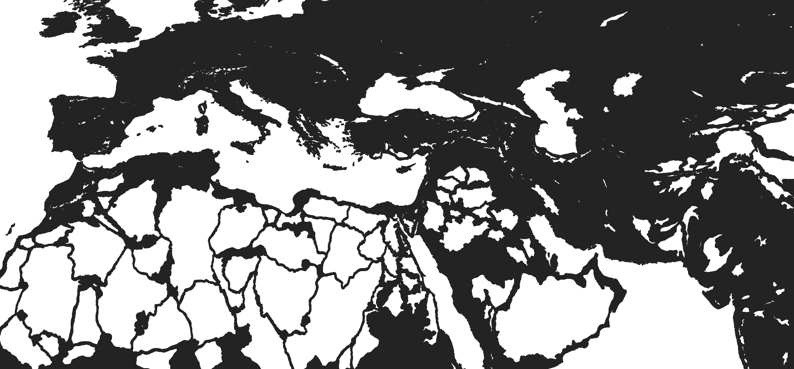

# Project 1400

### Global territorial modelling for a historical grand-strategy simulation

**32.44M total hex cells** · **24.15M active cells** · **97.05M adjacency relationships** · **31,264 final provinces**

[Results gallery](docs/results-and-examples.md) · [Technical evidence](docs/technical-evidence.md) · [QA case study](docs/qa-case-study-holes.md) · [Project role](docs/project-role.md)

  

> **Status:** active development. The published outputs are a verified working snapshot, not a claim of final cartographic perfection.

## Technical challenges solved

- **Unassigned cells after regional integration** → detected connected gaps, selected repair strategies by component scale and revalidated the complete active layer → **924,750 cells patched; 0 remain unassigned**.
- **Large gaps that could not be merged safely** → absorbed **35,491** small components, rebuilt **148** large components and created **686** provinces where a forced merge would have produced weak territorial shapes.
- **Topological consistency across independently processed regions** → integrated **43 superregions** against the global cell and adjacency layers → **0 duplicate hex identifiers** and all **24,146,859 active cells assigned**.
- **Weak shapes left after completeness repair** → ran four additional cleanup passes and evaluated merge candidates → **230,178 cell reassignments** and **20 province merges**.
- **Slow and opaque global experimentation** → separated expensive global preparation from deterministic regional execution, with persisted intermediate outputs, checkpoints and region-level reruns.

These are passed quality gates for the current dataset. Geographic calibration and visual refinement remain ongoing; [the evidence page](docs/technical-evidence.md) records the measurable snapshot and its limits.

---

## The challenge

Project 1400 is not simply an attempt to draw a detailed world map. It is a reproducible geospatial system that transforms a global foundation of **32,437,371 hexagonal cells** and **97,045,268 adjacency relationships** into a current layer of **31,264 coherent territorial units**.

The final provinces are intended as plausible strategic spaces rather than exact political borders from 1400. Their formation is informed by elevation, slope, hydrology, coastlines, climate, vegetation, historical population and impassable terrain without allowing any one variable to dictate the map mechanically.

The central difficulty is global generalisation. A method that works in Iberia may fail in the Sahara, the Himalayas, the Amazon basin or an archipelago. Regional tests, measurable acceptance criteria and structured visual review are therefore used to determine whether a change improves the system rather than merely fixing one local example.

---

## Design principles

- Geography should influence borders without determining them mechanically.
- Regional variation should emerge primarily from data rather than extensive manual tuning.
- Historical plausibility, geographic coherence and visual quality must be balanced.
- The same pipeline should remain effective across radically different environments.
- Every stage should be reproducible, inspectable and open to iteration.
- Local improvements should not reduce global consistency.

---

## Project documentation

| Area | Description |
|---|---|
| [Results and examples](docs/results-and-examples.md) | Global visual gallery, regional commentary and projection note |
| [Technical evidence](docs/technical-evidence.md) | Verified global metrics, coverage and post-processing results |
| [QA case study](docs/qa-case-study-holes.md) | Detection, repair and verification of unassigned spatial holes |
| [Overview](docs/overview.md) | Scope, objectives, constraints and success criteria |
| [Architecture](docs/architecture.md) | Processing stages, data flow and operational structure |
| [Design decisions](docs/design-decisions.md) | Major choices, alternatives and trade-offs |
| [Validation](docs/validation.md) | Defect taxonomy, regional tests and regression workflow |
| [Project role](docs/project-role.md) | Responsibilities and AI-assisted implementation model |
| [Data sources](assets/data-sources.md) | Source categories, quality questions and provenance policy |
| [Status and roadmap](docs/status-and-roadmap.md) | Current phase, completed evidence and next milestones |

<a href="#project-1400">Back to top ↑</a>

