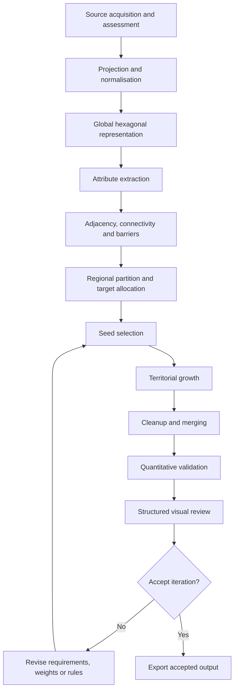

# System architecture

## Architectural approach

Project 1400 uses a staged pipeline. Expensive global preparation is separated from regional generation so that experiments can be rerun, inspected and compared without rebuilding every source layer.

## Stage responsibilities

### 1. Source acquisition and assessment

Candidate raster and vector datasets are compared for geographic coverage, resolution, consistency, provenance and practical usefulness. A source is not accepted merely because it exists; its limitations must be understood before it influences the model.

### 2. Projection and normalisation

Inputs arrive with different projections, formats, resolutions and classifications. They are transformed into a common analytical basis before attributes are attached to the spatial layer.

### 3. Global hexagonal representation

The world is represented as a continuous low-level hexagonal grid. Hexagons provide a consistent six-neighbour structure and reduce the directional bias of square grids.

### 4. Attribute extraction

Each cell receives the geographic and historical attributes needed by later stages. These can include elevation, slope, hydrology, coastal status, climate, vegetation, population and barrier classifications.

### 5. Adjacency and barrier graph

Neighbour relationships are represented explicitly. The system can then assign different crossing costs to ordinary terrain, rivers, mountain systems, coastlines or genuinely impassable areas.

### 6. Regional targets

The global province total is treated as a limited design budget. Broad regional allocations constrain the generator so that densely settled or geographically complex areas do not consume the entire budget and sparse regions do not become meaningless.

### 7. Seed selection

Territorial centres are selected through a composite score rather than random placement or uniform spacing. The score considers several forms of evidence while enforcing local spacing.

### 8. Constrained growth

Territories expand through the adjacency graph. Growth cost can respond to terrain, barriers, population structure, shape and existing territorial context.

### 9. Cleanup and merging

Residual cells, slivers and weak micro-territories are evaluated and merged according to shared border, compatibility and resulting shape quality.

### 10. Validation and iteration

Metrics identify structural defects; visual review identifies plausible-looking failures that a scalar score cannot express. A change is retained only after comparison across multiple test regions.

## Operational properties

The architecture is designed around:

- deterministic execution;
- explicit configuration and weights;
- incremental saves and checkpoints;
- region-level reruns;
- inspectable intermediate outputs;
- comparison between versions;
- recovery from long-running process failures.

## Data formats

Different formats are used according to workload rather than forcing all information into one container:

- **GeoPackage** for spatial inspection and GIS layers;
- **Parquet** for large analytical tables;
- **SQLite** for indexed relationships and auxiliary queries;
- **CSV** for compact summaries and human-readable exports.
