# Results and examples

[← Project README](../README.md) · [Technical evidence](technical-evidence.md) · [QA case study](qa-case-study-holes.md)

This gallery presents representative outputs from the current Project 1400 territorial-generation pipeline. The selection is deliberately global: it includes dense temperate regions, mountain systems, deserts, islands, archipelagos and fragmented coastlines.

The images are working results rather than a claim of final cartographic perfection. They are used to evaluate territorial density, contiguity, shape, barrier behaviour, coastal treatment and consistency between very different geographic environments.

> **Reading the maps:** each colour identifies a separate generated province. Colours repeat and do not represent states, cultures or political ownership. White areas indicate water or cells excluded by the current land and impassability masks.

## Current evidence

- [Technical evidence and verified metrics](technical-evidence.md)
- [QA case study: repairing unassigned spatial holes](qa-case-study-holes.md)
- [Validation methodology](validation.md)

## Featured regional results

### Iberia

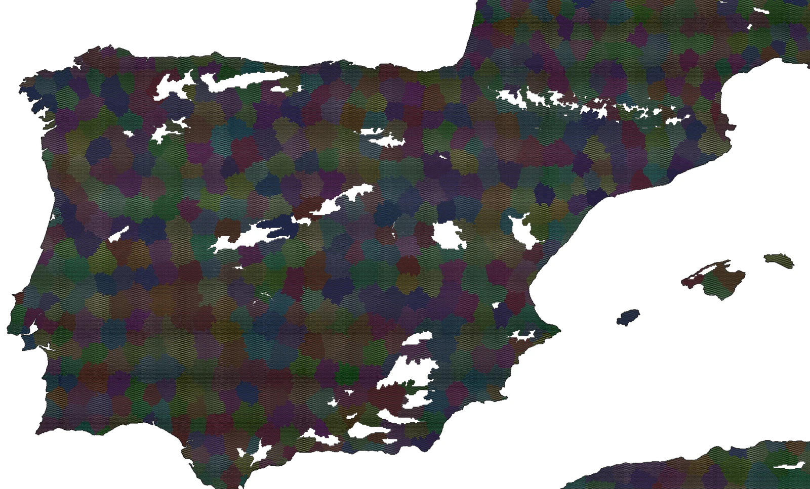

Iberia combines Atlantic and Mediterranean coastlines, the central plateau, several mountain systems and strong regional contrasts. It is a useful general test of density, inland compactness and the interaction between terrain and coast.

### Italy and the Alpine region

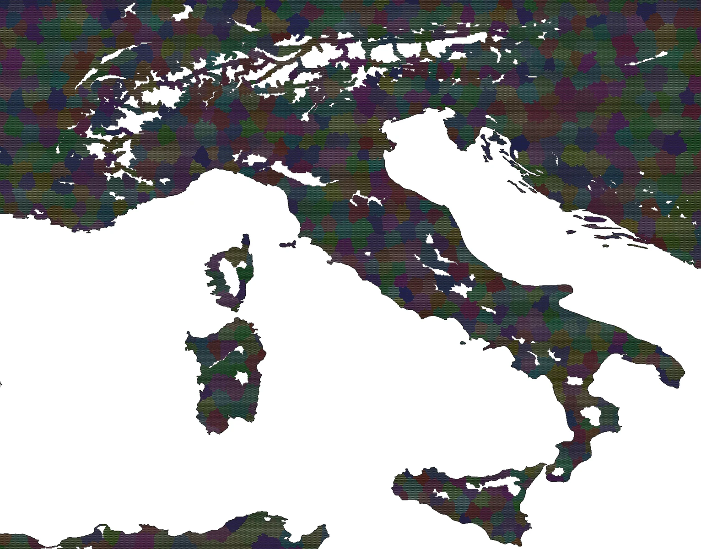

This view tests peninsular growth, narrow coastal spaces, major mountain barriers, islands and the transition between dense continental territory and the Italian peninsula.

### Morocco and Saharan corridors

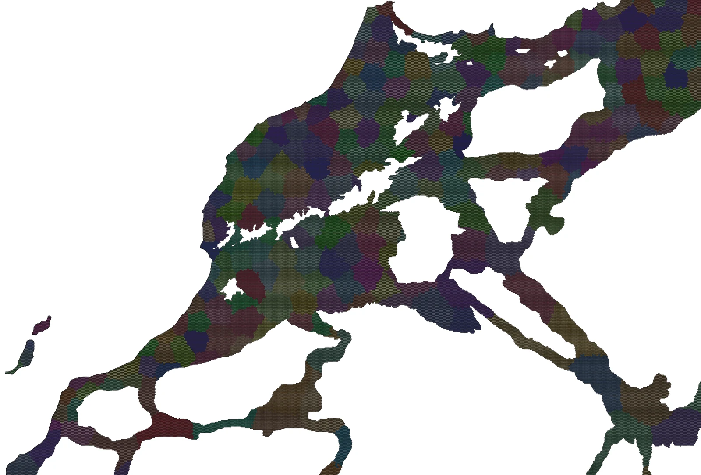

The region contrasts the Moroccan Atlantic and Mediterranean zones with the Atlas system and sparse Saharan corridors. It helps reveal whether the generator can preserve connectivity without treating low-density desert as ordinary continuous terrain.

### Mesoamerica and the Yucatán Peninsula

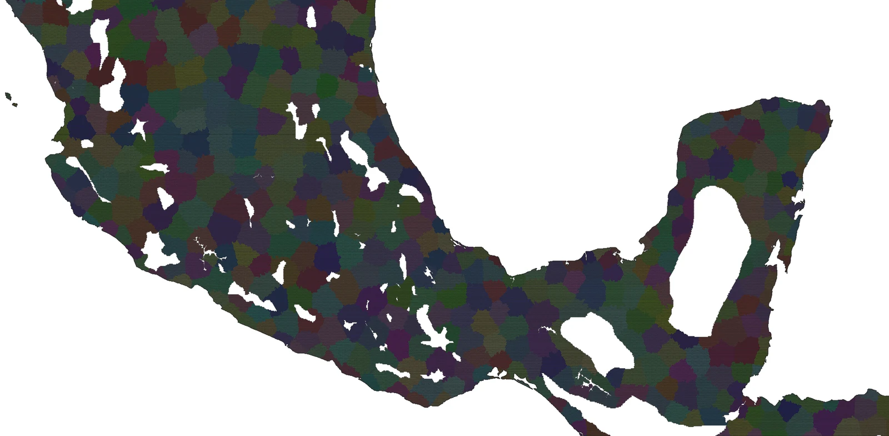

Mesoamerica combines high territorial density, complex relief, lakes, narrow land connections and the distinctive geometry of the Yucatán Peninsula.

### Southern China, Taiwan and northern Vietnam

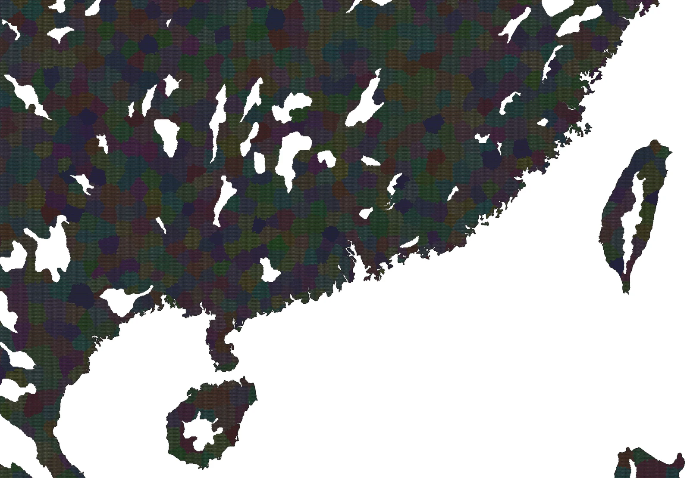

This output provides a demanding test of high-density continental territory, extensive hydrology, irregular coastline, offshore islands and a major island separated from the mainland.

### The Malay world

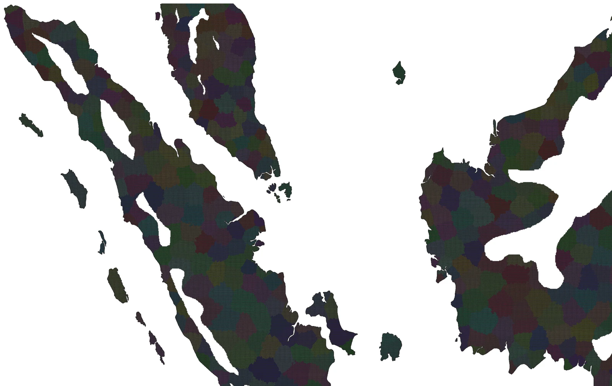

Malaya, Sumatra and Borneo test island separation, coastal geometry, narrow straits and the ability to scale territorial density across landmasses of very different sizes.

## Additional regional gallery

<table>
  <tr>
    <td width="50%">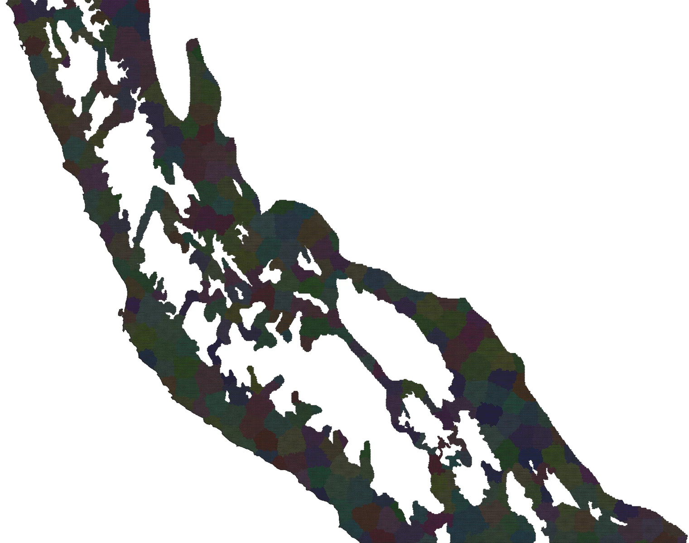 <strong>Central Andes and Tawantinsuyu region</strong> Mountain spine, coastal desert and inter-Andean corridors.</td>
    <td width="50%">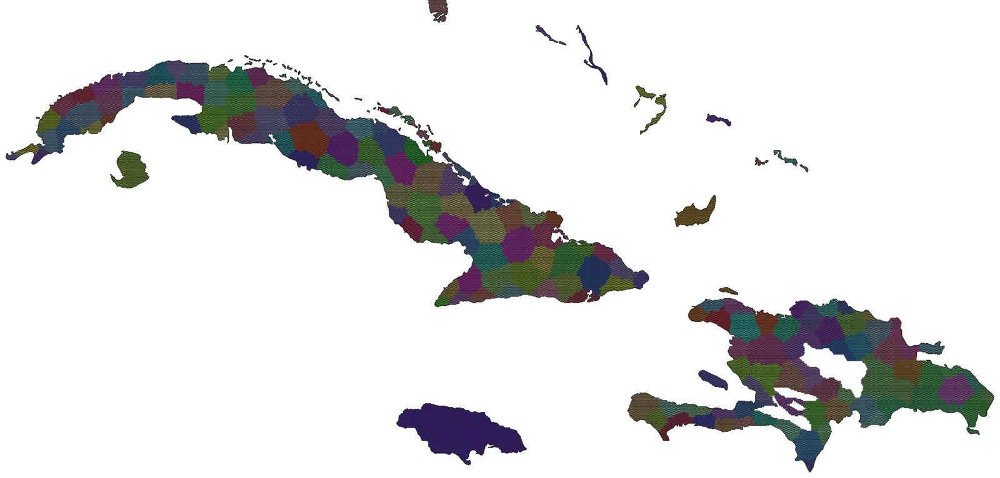 <strong>Cuba, Hispaniola and the Caribbean</strong> Large islands, archipelagos and fragmented coastal geography.</td>
  </tr>
  <tr>
    <td>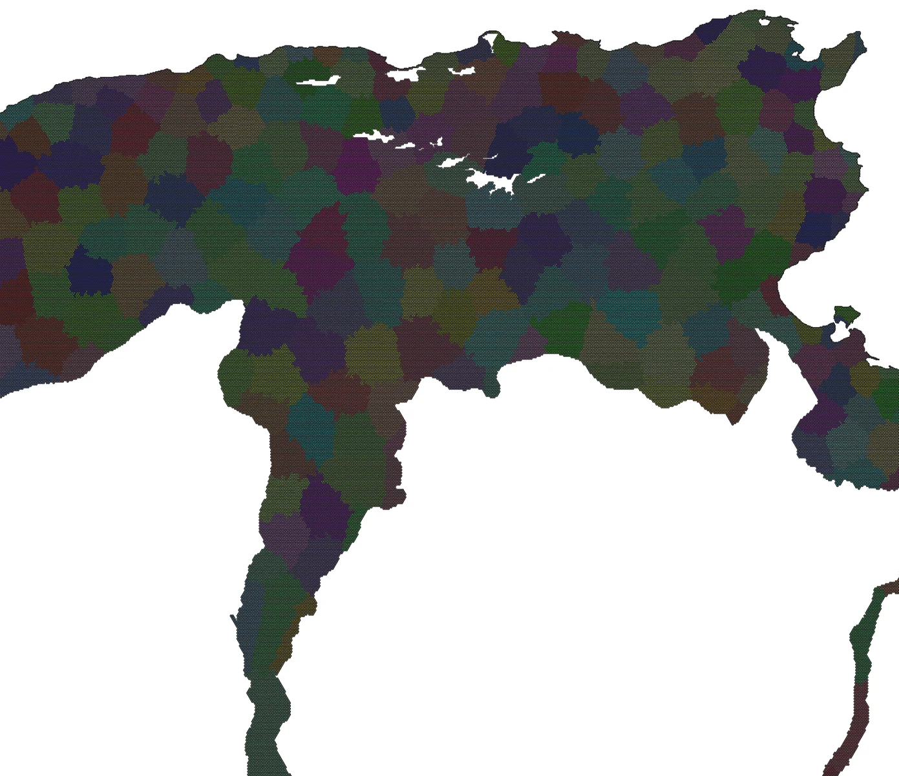 <strong>Central Maghreb and Tunisia</strong> Mediterranean coast, interior ranges and arid transitions.</td>
    <td>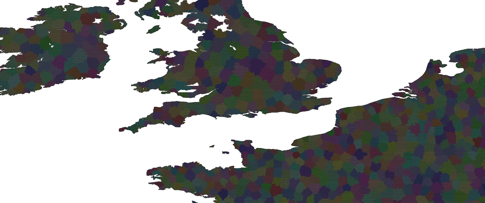 <strong>English Channel, Normandy and the Low Countries</strong> Dense cross-Channel comparison with complex coasts.</td>
  </tr>
  <tr>
    <td>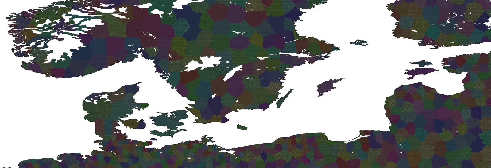 <strong>Baltic region</strong> High-latitude coastal and inland output; see the projection note below.</td>
    <td>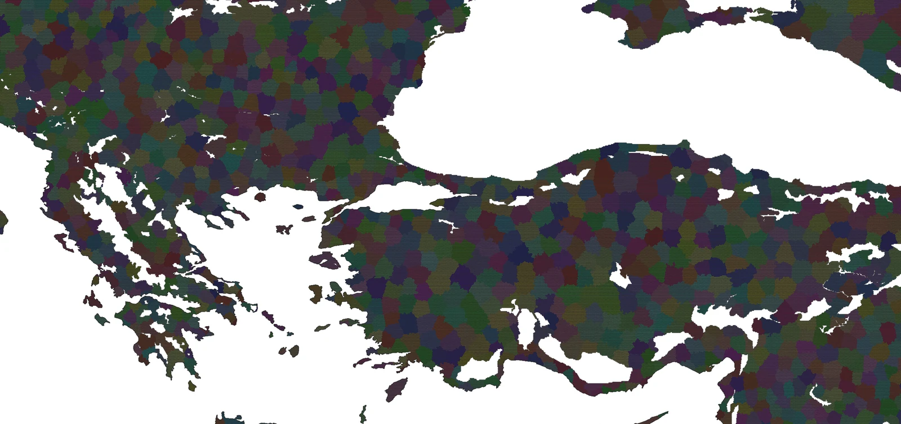 <strong>Aegean, Balkans and Anatolia</strong> Islands, peninsulas, straits and mountainous coastlines.</td>
  </tr>
  <tr>
    <td>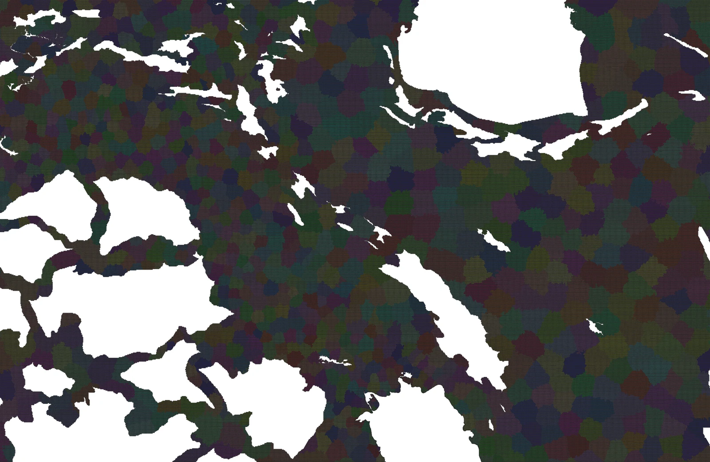 <strong>Mesopotamia and the Iranian Plateau</strong> River lowlands, mountain belts and plateau transitions.</td>
    <td>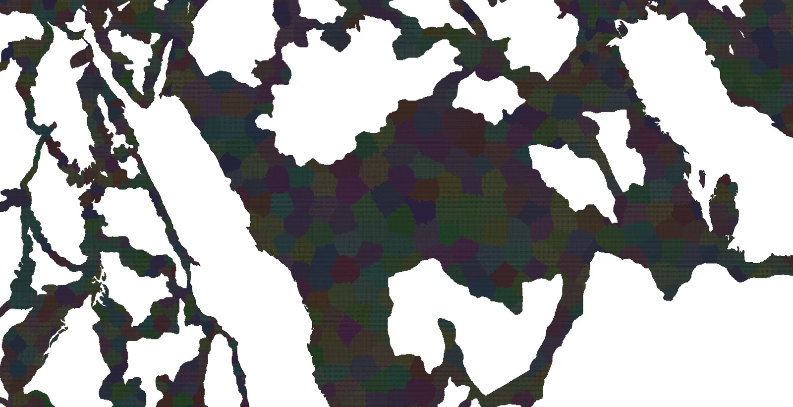 <strong>Nile–Iranian coast transect</strong> Nilotic zone, Red Sea, central Arabia, Persian Gulf and Iranian coast.</td>
  </tr>
  <tr>
    <td>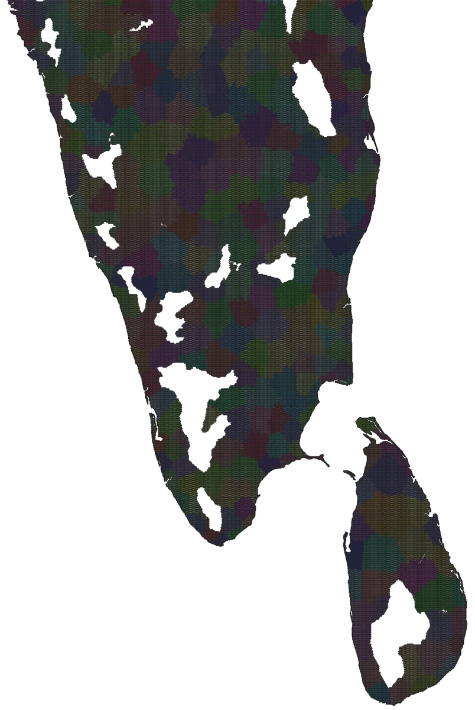 <strong>Southern India and Sri Lanka</strong> Peninsular territory, mountain gaps and island separation.</td>
    <td>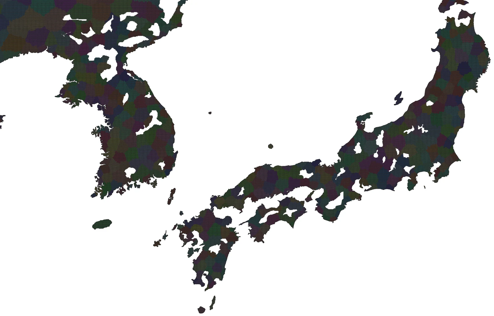 <strong>Korea and Japan</strong> Peninsula, island chains and highly fragmented coasts.</td>
  </tr>
</table>

## Projection note

The current processing output is displayed in **EPSG:6933 — WGS 84 / NSIDC EASE-Grid 2.0 Global**, a metre-based equal-area projection selected for consistent global spatial processing. It preserves area, but visible shapes become increasingly distorted toward high latitudes. The deformation visible in northern examples belongs to this projected display and does not necessarily indicate deformation in the underlying territorial logic.

Final presentation maps can be reprojected to a more familiar geographic display without changing province membership or adjacency.

## Publication status

These images document the current working state of the system. Regional outputs remain subject to further parameter calibration, systematic validation and visual refinement. Successful-looking examples are published alongside quantitative evidence and known limitations so that the portfolio represents the system honestly.

---

[← Project README](../README.md) · [Technical evidence](technical-evidence.md) · [Status and roadmap](status-and-roadmap.md)
